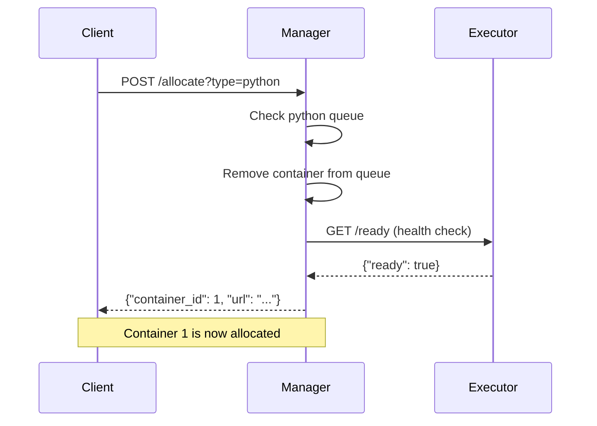
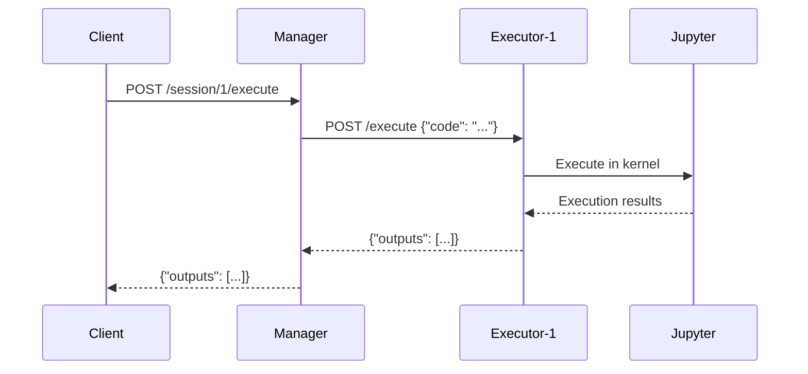
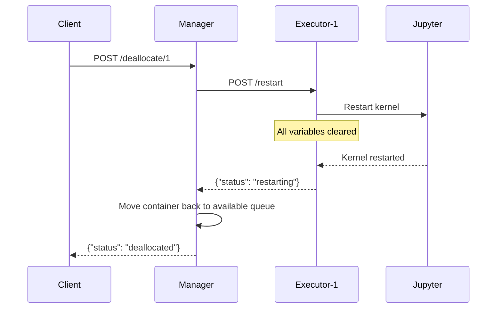

# Distributed Code Execution System

A production-ready distributed system for executing actions on separated environments (example comes with jupyter kernels), managed through a FastAPI routing service with intelligent container allocation and lifecycle management.


## Getting Started

To start thinking about this system, you need to understand three key steps:

1. **You need Docker images for your tasks** - These can be different types ([see container types](#container-type-specialization)) depending on what kind of execution environment you need (Python, ML/Kaggle, Node.js, etc.)

2. **Build the required images** - At minimum you need the manager image, plus your executor images (or use the provided reference implementations)

3. **Run docker compose** - Generate and start your deployment with the desired number and types of containers

That's it. The system handles allocation, routing, and lifecycle management automatically.

## Table of Contents

- [Architecture Overview](#architecture-overview)
- [System Components](#system-components)
- [Container Allocation System](#container-allocation-system)
- [API Contracts](#api-contracts)
- [Quick Start](#quick-start)
- [Complete Setup Guide](#complete-setup-guide)
- [Mountable Volumes](#mountable-volumes)
- [Advanced Features](#advanced-features)
- [Production Deployment](#production-deployment)
- [Workflows](#workflows)
- [Troubleshooting](#troubleshooting)

## Architecture Overview

The system implements a **manager-worker architecture** where a central manager service routes execution requests to a pool of isolated executor containers. Each executor container runs its own Jupyter kernel, providing complete isolation between execution environments.

```
Client Applications
       ↓
Manager Service (FastAPI) :5000
   ↓    ↓    ↓    ↓
Executor Containers: :60000, :60001, :60002, :60003...
```

### Key Design Principles

- **Container Isolation**: Each execution environment is completely isolated
- **Intelligent Allocation**: Type-based container allocation with queuing
- **Fault Tolerance**: Containers can be restarted without affecting others  
- **Scalability**: Support for 100+ containers in production
- **Stateful Execution**: Variables persist within containers across requests
- **Custom Code Loading**: Mount external Python code into all containers

## System Components

### 1. Manager Service

The **Manager** is a FastAPI application that serves as the central orchestrator:

**Responsibilities:**
- Route execution requests to available containers
- Manage container allocation/deallocation lifecycle  
- Maintain type-based container queues (python, kaggle, nodejs, etc.)
- Health monitoring and readiness checks
- Request/response proxying and error handling
- Container discovery and configuration management

**Core Endpoints:**
- `POST /allocate` - Allocate a container (optionally by type)
- `POST /deallocate/{container_id}` - Deallocate and restart container
- `POST /session/{container_id}/execute` - Execute code in specific container
- `GET /session/{container_id}/ready` - Check if container kernel is ready
- `GET /status` - System status with allocation counts

### 2. Executor Containers

Each **Executor Container** can be any implementation that follows the required API contract. The `container_images/instance/` directory provides a **reference implementation** using Jupyter kernels with FastAPI, but you can implement your own using any technology stack.

**Reference Implementation** (`container_images/instance/` directory):
- Jupyter kernel with FastAPI wrapper
- Python code execution in isolated environment
- Custom Python file loading from mounted volumes
- Kernel restart and state management
- Health and readiness monitoring

**Required API Contract:**
All executor instances MUST implement these endpoints for manager compatibility:

- `GET /health` - Return `{"status": "ok"}` if container is healthy
- `GET /ready` - Return `{"ready": true/false}` with kernel readiness
- `POST /execute` - Execute code and return outputs 
- `POST /restart` - Restart execution environment (clears all state)

**Custom Implementation Guide:**
You can implement executor containers in any language/framework as long as they expose these HTTP endpoints and follow the expected request/response formats.

Example implementations in this repository:
- `container_images/instance/` - **Reference implementation** (Jupyter + FastAPI)
- `container_images/kaggle_image/` - **ML-focused implementation** (Jupyter + ML libraries)

To create your own executor implementation:
1. Choose your runtime (Node.js, Go, Rust, etc.)  
2. Implement the 4 required HTTP endpoints
3. Build your Docker image
4. Use it in compose configurations with `--types your_type:count`

## Container Allocation System

The manager implements an intelligent allocation system using **type-based queues**:

### Allocation Flow

1. **Request**: Client requests container (optionally specifying type)
2. **Queue Selection**: Manager selects appropriate queue based on type
3. **Container Assignment**: First available container is allocated
4. **State Tracking**: Container moves from "available" to "allocated" 
5. **Usage**: Client uses allocated container for multiple operations
6. **Deallocation**: Container is returned to queue after kernel restart

### Container States

```
[Available in Queue] → [Allocated] → [Executing] → [Allocated]
                                ↓
[Available in Queue] ← [Restarting] ← [Deallocated]
```

### Type-Based Queues

Different container types serve different purposes:

- **`python`**: Standard Python execution environment
- **`kaggle`**: Pre-loaded with ML libraries and dataset access
- **`nodejs`**: JavaScript/Node.js execution (future)
- **Custom types**: User-defined container configurations

### Queue Management

```python
# Each type maintains its own queue
available_containers_by_type = {
    "python": Queue([0, 1, 2, 3]),
    "kaggle": Queue([4, 5]),  
    "nodejs": Queue([6, 7])
}

# Allocation removes from appropriate queue
allocated_containers = {1, 4}  # Currently in use
```

## API Contracts

### Manager API Contract

The manager exposes a REST API for clients:

#### Allocation Management
```http
POST /allocate?container_type=python
→ {"container_id": 1, "url": "http://executor-001:8432", "type": "python"}

POST /deallocate/1  
→ {"status": "deallocated", "container_id": 1}

GET /status
→ {
  "available_containers": 6,
  "allocated_containers": 2, 
  "total_containers": 8,
  "available_by_type": {"python": 4, "kaggle": 2},
  "allocated_container_ids": [1, 4]
}
```

#### Code Execution
```http
POST /session/1/execute
Content-Type: application/json
{"code": "x = 42\nprint(x)"}
→ {"outputs": [{"type": "stream", "text": "42\n"}]}

GET /session/1/ready  
→ {"ready": true}

POST /session/1/restart
→ {"status": "restarting"}
```

### Executor API Contract

Each executor container MUST implement this contract:

#### Health & Readiness
```http
GET /health
→ {"status": "ok"}

GET /ready  
→ {"ready": true, "reason": null}
// OR {"ready": false, "reason": "kernel_not_started"}
```

#### Code Execution
```http
POST /execute
Content-Type: application/json  
{"code": "print('hello')"}
→ {
  "outputs": [
    {"type": "stream", "text": "hello\n"}
  ]
}
```

#### Kernel Management
```http
POST /restart
→ {"status": "restarting"} 

GET /restart-status
→ {"restarting": false}
```


## Minimal Reproducible Example

Here's a complete working example you can run in 5 minutes:

### Step 1: Build the System

```bash
# Clone and enter directory
git clone <repository-url>
cd executors

# Build the required images
docker build -t manager-prebuilt ./manager/
docker build -t python ./container_images/instance/
```

### Step 2: Deploy System

This will create 4 python containers that you can use to execute code in isolated environments.

```bash
# Generate basic compose configuration
python generate_compose.py \
  --num-containers 4 \
  --types python:4 \
  --output basic-demo.yml

# Start the system  
docker compose -f basic-demo.yml up -d

# Wait for system to be ready (30 seconds)
echo "Waiting for system to start..."
sleep 30
```

### Step 3: Execute Agent Code

```bash
curl -X POST http://localhost:5000/session/0/execute \
  -H "Content-Type: application/json" \
  -d '{"code": "print(41)"}'

curl -X POST http://localhost:5000/session/1/execute \
  -H "Content-Type: application/json" \
  -d '{"code": "print(42)"}'
```

### Step 4: Test with Python requests

```python
import requests

response = requests.post("http://localhost:5000/session/0/execute", 
                        json={"code": "print(41)"})
print(response.json())

response = requests.post("http://localhost:5000/session/1/execute", 
                        json={"code": "print(42)"})
print(response.json())
```

### Step 5: Cleanup

```bash
# Stop the system
docker compose -f basic-demo.yml down
```

### What This Demonstrates

✅ **Container Isolation**: Each container maintains separate state  
✅ **Direct Code Execution**: Execute Python code directly via HTTP API  
✅ **API Usage**: Simple HTTP calls to manager  
✅ **Scalability**: Multiple containers handle different tasks  

This example shows how to execute code across multiple isolated execution environments.

## Quick Start

Alternative quick start using the provided examples:

```bash
# Use the simple example  
cd examples/simple_test/
./run_example.sh
```

This script will:
- Build all Docker images
- Start manager + 4 executor containers  
- Run comprehensive tests
- Show you the API in action
- Clean up when done

## Complete Setup Guide

### Prerequisites
- Docker Desktop (recommended) or Docker Engine
- Python 3.12+ (for generator scripts and tests)
- 8GB+ RAM for production deployments

### Step 1: Build Base Images

```bash
# Build the reference executor implementation
docker build -t python ./container_images/instance/

# Build manager image  
docker build -t manager-prebuilt ./manager/

```

### Step 2: Generate Deployment Configuration

```bash
# Basic deployment (4 containers)
python generate_compose.py \
  --num-containers 4 \
  --types executor-prebuilt:4 \
  --output docker-compose-basic.yml

# Production deployment (100 containers, mixed types)  
python generate_compose.py \
  --num-containers 100 \
  --types executor-prebuilt:60,kaggle:30,nodejs:10 \
  --output docker-compose-production.yml \
  --start-port 60000

# With custom code loading
python generate_compose.py \
  --num-containers 10 \
  --types executor-prebuilt:10 \
  --mountable-volumes /path/to/your/python/code \
  --output docker-compose-with-code.yml
```

### Step 3: Deploy the System

```bash
# Start all services
docker compose -f docker-compose-basic.yml up -d

# Verify manager is running
curl http://localhost:5000/health
# → {"status": "ok"}

# Check system status  
curl http://localhost:5000/status
# → Shows container counts and availability
```

### Step 4: Verify Container Readiness

```bash
# Wait for containers to be ready (may take 30-60 seconds)
for i in {0..3}; do
  echo "Checking container $i..."
  curl http://localhost:5000/session/$i/ready
done
```

## Custom Code Loading

The reference implementation (`container_images/instance/`) supports loading custom Python code into execution environments. See [`container_images/instance/README.md`](container_images/instance/README.md) for detailed documentation on:

- Mounting code directories into containers
- Automatic loading of Python files during startup  
- Using custom functions across all containers
- Examples and testing procedures

Other executor implementations may provide their own code loading mechanisms or none at all, depending on requirements.

## Advanced Features

### Container Type Specialization

Define specialized container types for different workloads:

```bash
# Mixed environment deployment
python generate_compose.py \
  --num-containers 20 \
  --types python:10,kaggle:8,custom:2 \
  --output mixed-deployment.yml

# Kaggle containers come with ML libraries pre-installed
# Custom containers can use your own Dockerfile
```

### GPU Support

Enable GPU access for containers with dedicated GPU assignment:

```bash
# GPU-enabled deployment with 4 containers on GPUs 0,1,2,3
python generate_compose.py \
  --num-containers 4 \
  --types python:4 \
  --gpu-ids 0,1,2,3 \
  --output gpu-deployment.yml

# Mixed GPU deployment (8 containers, 4 with GPUs)
python generate_compose.py \
  --num-containers 8 \
  --types python:8 \
  --gpu-ids 0,1,2,3 \
  --output mixed-gpu-deployment.yml
```

**GPU Requirements:**
- NVIDIA Docker runtime or nvidia-docker installed
- Each container gets exclusive access to one GPU
- Maximum N containers with N available GPUs
- GPU IDs must be unique across containers
- Containers without GPU assignment run on CPU only

### Environment Variables

Pass configuration to containers:

```bash
python generate_compose.py \
  --num-containers 5 \
  --types python:5 \
  --env "DEBUG=true,MAX_MEMORY=2G,API_KEY=secret" \
  --output configured-deployment.yml
```

### Execution Timeout Configuration

Control how long code can execute before timing out. This is useful for long-running experiments:

```bash
# Default: 180 seconds (3 minutes)
python generate_compose.py \
  --num-containers 8 \
  --types executor-prebuilt-kaggle-gpu:8 \
  --gpu-ids 0,1,2,3,4,5,6,7 \
  -o docker-compose.yml

# Long experiments: 1 hour timeout
python generate_compose.py \
  --num-containers 8 \
  --types executor-prebuilt-kaggle-gpu:8 \
  --gpu-ids 0,1,2,3,4,5,6,7 \
  --env "EXECUTION_TIMEOUT=3600" \
  -o docker-compose.yml

# Quick tests: 1 minute timeout
python generate_compose.py \
  --num-containers 4 \
  --types python:4 \
  --env "EXECUTION_TIMEOUT=60" \
  -o docker-compose.yml

# Custom timeout for specific experiments
python generate_compose.py \
  --num-containers 8 \
  --types kaggle:8 \
  --env "EXECUTION_TIMEOUT=7200" \
  -o docker-compose.yml  # 2 hours for training
```

See `configs/` directory for preset configurations.

### Scaling and Resource Management

```bash
# Resource-constrained deployment
python generate_compose.py \
  --num-containers 50 \
  --types python:50 \
  --output resource-optimized.yml
# Containers automatically get: 256M RAM, 0.25 CPU
```

### Health Monitoring

```bash
# Check overall system health
curl http://localhost:5000/status

# Check specific container
curl http://localhost:5000/session/5/health  

# Monitor allocation patterns
curl http://localhost:5000/status | jq '.available_by_type'
```

## Production Deployment

### High-Availability Configuration

```bash
# Large-scale production setup
python generate_compose.py \
  --num-containers 200 \
  --types python:120,kaggle:50,specialized:30 \
  --output production-ha.yml \
  --start-port 60000

# Deploy with monitoring
docker compose -f production-ha.yml up -d

# Set up load balancer (nginx/haproxy) in front of manager:5000
```

### Resource Planning

For production deployments:

- **Manager**: 1-2GB RAM, 2 CPU cores minimum
- **Executor Containers**: 256MB RAM, 0.25 CPU each (configurable)
- **Network**: 1Gbps for 100+ containers
- **Storage**: 10GB+ for images, logs, and temporary files

### Monitoring and Logging

```bash
# View system logs
docker compose -f production-ha.yml logs manager | tail -100

# Monitor container performance  
docker stats

# Check allocation patterns
watch -n 5 'curl -s http://localhost:5000/status | jq'
```

## Workflows

### Container Allocation Workflow



### Code Execution Workflow



### Container Restart Workflow



## Troubleshooting

### Common Issues

#### 1. Containers Not Responding
```bash
# Check if containers are running
docker compose ps

# View container logs
docker compose logs executor-001

# Check health endpoints directly
curl http://localhost:60000/health
```

#### 2. Manager Can't Reach Containers
```bash
# Verify network configuration
docker network ls
docker network inspect executors_default

# Check container config  
cat container_config.json

# Test container URLs manually
curl http://executor-001:8432/health  # From inside network
```

#### 3. Kernel Not Ready
```bash
# Check kernel startup logs
docker compose logs executor-001 | grep -i kernel

# Check if volumes are mounted correctly
docker exec executor-001 ls -la /code

# Test kernel manually
curl -X POST http://localhost:60000/execute \
  -H "Content-Type: application/json" \
  -d '{"code": "1+1"}'
```

#### 4. Memory/Resource Issues
```bash
# Check resource usage  
docker stats

# Reduce container count or increase resources
python generate_compose.py --num-containers 10  # Instead of 100

# Monitor system resources
htop
```

#### 5. Port Conflicts
```bash
# Use different port range
python generate_compose.py \
  --start-port 70000 \  # Instead of 60000
  --num-containers 10

# Check what's using ports
netstat -tulpn | grep :60000
```

### Performance Optimization

#### Container Startup Time
- Pre-build images with common dependencies
- Use image caching strategies
- Mount code volumes instead of copying into images

#### Execution Performance  
- Increase container resource limits
- Use SSD storage for Docker volumes
- Monitor and tune garbage collection

#### Network Performance
- Use Docker networks instead of host networking
- Implement connection pooling in clients
- Consider container placement on multiple hosts

### Debug Mode

Enable debug logging:

```bash
# Set debug environment variables
python generate_compose.py \
  --env "DEBUG=true,LOG_LEVEL=debug" \
  --num-containers 5 \
  --output debug-deployment.yml

docker compose -f debug-deployment.yml up -d

# View debug logs
docker compose -f debug-deployment.yml logs -f
```

### System Limits

**Default Configuration:**
- Max 1000 concurrent HTTP connections per manager
- 30-second timeout for code execution
- 15-second timeout for health checks  
- 256MB RAM per container
- 0.25 CPU per container

**Increasing Limits:**
Modify the source code in `manager/main.py` and `instance/kernel_executor.py` to adjust timeouts and resource limits as needed.

---

## Support

For issues, feature requests, or questions:
1. Check this README for common solutions
2. Review container logs for error messages  
3. Test with minimal configuration first
4. Check Docker and network connectivity

This system is production-ready and scales to hundreds of containers with proper resource planning and monitoring.